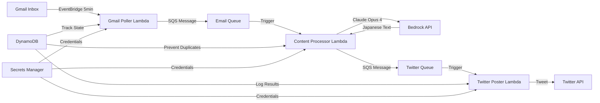

# System Architecture Documentation

## Overview

This Twitter bot uses a serverless event-driven architecture on AWS to automatically process emails and post Japanese translations to Twitter.

## Data Flow



## Components

### 1. Gmail Poller Lambda (`twitter-bot-gmail-poller`)

**Purpose**: Periodically check Gmail for new emails

**Trigger**: EventBridge rule every 5 minutes

**Process**:
1. Retrieve last check timestamp from DynamoDB
2. Query Gmail API for new messages
3. Extract email content (subject, body, sender)
4. Queue messages to SQS for processing
5. Update last check timestamp

**Dependencies**:
- Google API Python Client
- Gmail OAuth credentials in Secrets Manager

### 2. Content Processor Lambda (`twitter-bot-content-processor`)

**Purpose**: Translate emails to Japanese tweets

**Trigger**: SQS Queue (Email Queue)

**Process**:
1. Receive email content from queue
2. Check if already processed (DynamoDB)
3. Call Bedrock Claude Opus 4 with translation prompt
4. Generate 280-character Japanese tweet
5. Queue tweet for posting
6. Mark email as processed

**Configuration**:
- Model: `us.anthropic.claude-opus-4-20250514-v1:0`
- Temperature: 0.7
- Max tokens: 1000

### 3. Twitter Poster Lambda (`twitter-bot-twitter-poster`)

**Purpose**: Post tweets to Twitter

**Trigger**: SQS Queue (Twitter Queue)

**Process**:
1. Receive tweet text from queue
2. Authenticate with Twitter API v2
3. Post tweet
4. Update DynamoDB with tweet ID
5. Handle rate limits gracefully

**Dependencies**:
- Tweepy library
- OAuth 1.0a credentials

## AWS Resources

### DynamoDB Tables

1. **twitter-bot-processed-emails**
   - Primary Key: `email_id` (String)
   - Attributes: `status`, `tweet_text`, `tweet_id`, `processed_at`
   - Purpose: Track processed emails and prevent duplicates

2. **twitter-bot-app-state**
   - Primary Key: `key` (String)
   - Attributes: `timestamp`, `value`
   - Purpose: Store application state (last check time, etc.)

### SQS Queues

1. **twitter-bot-email-queue**
   - Message retention: 14 days
   - Visibility timeout: 5 minutes
   - Connects: Gmail Poller → Content Processor

2. **twitter-bot-twitter-queue**
   - Message retention: 14 days
   - Visibility timeout: 5 minutes
   - Connects: Content Processor → Twitter Poster

### IAM Role

**twitter-bot-lambda-role**
- Basic Lambda execution
- DynamoDB read/write
- SQS send/receive/delete
- Secrets Manager read
- Bedrock model invocation

## Deployment Process

### Prerequisites
1. AWS Account with Bedrock access
2. Gmail API credentials
3. Twitter Developer account
4. AWS CLI configured

### Deployment Steps

1. **Create AWS Infrastructure**
```bash
# DynamoDB tables
aws dynamodb create-table --table-name twitter-bot-processed-emails ...
aws dynamodb create-table --table-name twitter-bot-app-state ...

# SQS queues
aws sqs create-queue --queue-name twitter-bot-email-queue ...
aws sqs create-queue --queue-name twitter-bot-twitter-queue ...

# IAM role
aws iam create-role --role-name twitter-bot-lambda-role ...
```

2. **Store Secrets**
```bash
aws secretsmanager create-secret --name twitter-bot/gmail-api ...
aws secretsmanager create-secret --name twitter-bot/twitter-api ...
```

3. **Create Lambda Layer**
```bash
cd lambda_functions
mkdir -p layer/python
pip install -r requirements.txt -t layer/python/
zip -r python_dependencies_layer.zip python/
aws lambda publish-layer-version ...
```

4. **Deploy Lambda Functions**
```bash
# Package and deploy each function
zip -r lambda_function.zip lambda_function.py
aws lambda create-function ...
```

5. **Configure Triggers**
```bash
# EventBridge for polling
aws events put-rule --schedule-expression "rate(5 minutes)" ...

# SQS triggers
aws lambda create-event-source-mapping ...
```

## Error Handling

### Retry Strategy
- SQS provides automatic retries with exponential backoff
- Failed messages go back to queue after visibility timeout
- Max receive count: 3 before DLQ (if configured)

### Common Issues
1. **Rate Limits**: Twitter poster handles 429 errors gracefully
2. **Token Expiry**: Gmail tokens auto-refresh using refresh token
3. **JSON Parsing**: Special characters escaped properly
4. **Model Access**: Using inference profiles for Bedrock

## Monitoring

### CloudWatch Metrics
- Lambda invocations and errors
- SQS queue depth and age
- DynamoDB throttles

### Logs
- Structured logging with correlation IDs
- Error stack traces for debugging
- Performance metrics (duration, memory)

## Security Considerations

1. **Credentials**: All stored in Secrets Manager, never in code
2. **IAM**: Least privilege principle, specific resource ARNs
3. **Input Validation**: Email content sanitized before processing
4. **Network**: Lambda functions in VPC not required (using AWS APIs)
5. **Encryption**: All data encrypted at rest and in transit

## Cost Optimization

1. **Lambda Memory**: Optimized per function (256-512MB)
2. **Polling Frequency**: 5 minutes balances cost vs responsiveness
3. **DynamoDB**: On-demand pricing for variable workload
4. **Logs**: 30-day retention to control costs
5. **Bedrock**: Using most cost-effective model that meets quality needs

## Future Enhancements

- Add image support from emails
- Implement thread creation for long content
- Add approval workflow via DynamoDB
- Create CloudFormation/CDK template
- Add CloudWatch dashboard
- Implement DLQ for failed messages