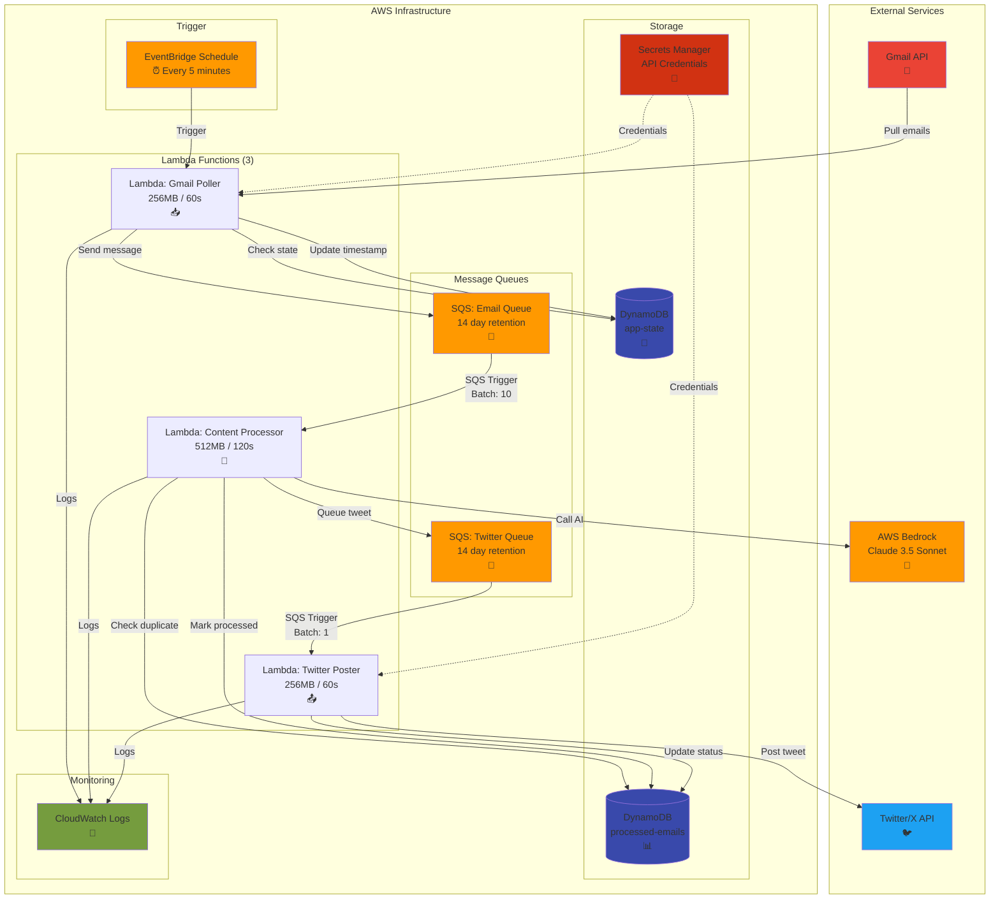
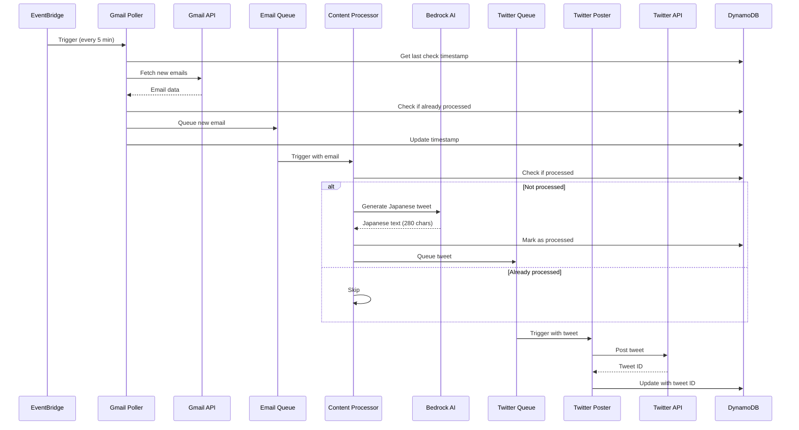

# Twitter Bot Architecture Diagram (Simplified)

## Visual Architecture Overview

## Data Flow Sequence (Simplified)

## Component Details (Simplified)

### 🔵 **Trigger Layer**
- **EventBridge**: Scheduled trigger every 5 minutes (polling only)

### 🟢 **Processing Layer (3 Lambdas)**
- **Gmail Poller**: Fetches new emails from Gmail
- **Content Processor**: Translates to Japanese using AI (512MB/120s)
- **Twitter Poster**: Posts to Twitter API

### 🟡 **Queue Layer**
- **Email Queue**: Decouples email fetching from processing
- **Twitter Queue**: Decouples AI processing from Twitter posting

### 🔴 **Storage Layer**
- **DynamoDB Tables**: Track state and prevent duplicates
- **Secrets Manager**: Secure credential storage

### ⚫ **Monitoring Layer**
- **CloudWatch Logs**: Centralized logging for all Lambda functions

## Key Design Patterns

1. **Pull-Based Architecture**: System polls Gmail (no webhooks needed)
2. **Event-Driven Processing**: SQS triggers automate the flow
3. **Queue-Based Decoupling**: SQS ensures resilience and retry capability
4. **Serverless Computing**: No servers to manage, automatic scaling
5. **Idempotency**: DynamoDB tracking prevents duplicate processing

## Simplified Benefits

- **No API Gateway**: No public endpoints to secure
- **No Webhooks**: No tokens to refresh or endpoints to maintain
- **Single Path**: One clear flow from Gmail to Twitter
- **3 Lambdas Only**: Minimal components to manage
- **Pull Model**: System controls when to check for emails

## Resilience Features

- **Automatic Retries**: SQS handles failed messages with exponential backoff
- **14-Day Message Retention**: Long retention period prevents data loss
- **State Tracking**: DynamoDB ensures consistency across restarts
- **Error Isolation**: Queue decoupling prevents cascading failures